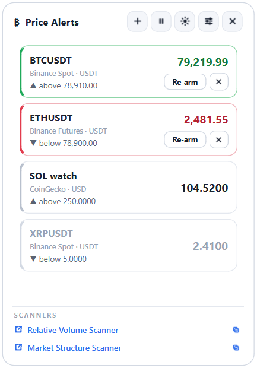
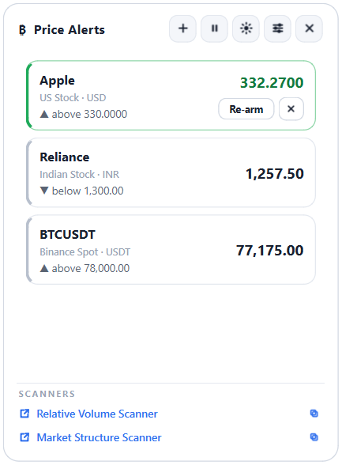
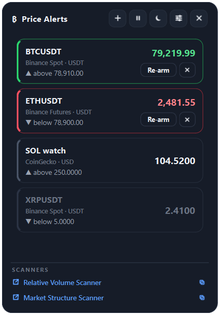
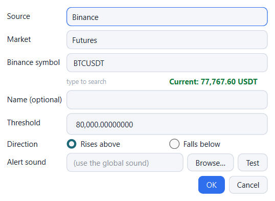

# Crypto Price Alert Widget for Windows

**A free, lightweight desktop price alert app for crypto *and* stocks.** Set price
alerts for Bitcoin, Ethereum, any altcoin, **US stocks** (AAPL, TSLA, MSFT…) and
**Indian stocks** (NSE/BSE — RELIANCE, TCS, INFY…). Get a **desktop notification + a
looping sound** the moment a price **rises above** or **falls below** your target, and
keep a small always‑available **price widget** on your desktop and in the system tray.

Crypto prices come **live over WebSocket** from **Binance** (spot **and** USDⓈ‑M
futures); **CoinGecko** covers thousands of altcoins; **stock prices** (US + India) come
from **Yahoo Finance** — no login for any of them. You pick the source per alert. 100%
local, no account, no API key, no data leaves your PC.

<p align="center">
  
  &nbsp;
  
  &nbsp;
  
</p>

<p align="center">
  <a href="../../releases/latest"></a>
  
  
  
</p>

---

## Features

- 🔔 **Price alerts above / below a threshold** with a one‑time desktop notification and
  an **alert sound that loops until you acknowledge it** (built‑in beep, or your own
  WAV / MP3 — global or per‑alert).
- 🟢 / 🔴 Triggered alerts turn **green** ("rises above") or **red** ("falls below") and
  stay latched until you press **Re‑arm** (watch again) or **Dismiss** (clear).
- ⚡ **Real‑time prices over WebSocket** for Binance **Spot** and **Futures**; CoinGecko
  is polled on an interval. Automatic REST fallback, all within API rate limits.
- 🔀 **Per‑alert price source** — CoinGecko, Binance Spot, Binance USDⓈ‑M Futures, or
  **Stocks (US / India)** — with a **searchable symbol picker** (validated lists for
  crypto; live ticker search for stocks) and a **live current price** shown while you
  set the alert.
- 📈 **Stock price alerts** for US markets (NASDAQ, NYSE…) and **Indian markets (NSE /
  BSE)** via Yahoo Finance — search by company name or ticker, no brokerage account
  needed.
- 🖥️ **Always‑on‑top desktop widget** (optional) **+ system‑tray icon**. Frameless,
  draggable, adjustable opacity.
- 🌗 **Light / dark / follow‑system** theme.
- 🚀 **Starts automatically on sign‑in** (optional toggle) — the widget is back after
  every reboot with your alerts and window position intact.
- 🔗 One‑click links to the **Relative Volume** and **Market Structure** scanners.
- 🔒 **Local‑only & free.** No sign‑up, no API key; the only network traffic is the price
  requests to CoinGecko / Binance / Yahoo Finance.

---

## Download & install (recommended)

**No Python required.** Everything is bundled.

1. Go to the [**latest release**](../../releases/latest) and download
   **`CryptoPriceAlertSetup-x.y.z.exe`**.
2. Run it. It installs per‑user (no admin prompt) and offers optional **desktop
   shortcut** and **start‑on‑sign‑in** checkboxes.
3. Launch **Crypto Price Alerts** from the Start menu. A tray icon appears and the
   widget docks on screen.

> Windows may show a SmartScreen "unrecognized app" notice for the unsigned installer —
> click **More info → Run anyway**.

To remove it later: **Settings → Apps → Crypto Price Alerts → Uninstall** (it asks
whether to keep or delete your saved alerts).

---

## How to use it

### Add an alert
Click **＋** on the widget:

| Field | Notes |
| --- | --- |
| **Source** | CoinGecko, Binance Spot, Binance Futures, or **Stock** |
| **Market / Region** | Binance: Spot or Futures. Stock: **United States** or **India**. |
| **Symbol** | Start typing to search. Crypto/Binance: validated list (`bitcoin`, `solana` … / `BTCUSDT`, `ETHUSDT` …). Stock: live company/ticker search (`apple`, `AAPL` … / `reliance`, `RELIANCE.NS` …). The **current price** shows live underneath. |
| **Threshold** & **Direction** | Rises above / Falls below |
| **Alert sound** | Optional per‑alert override; blank = the global sound |

<p align="center">
  
</p>

**Stock ticker format:** US stocks use the plain ticker (`AAPL`, `TSLA`). Indian stocks
use Yahoo's exchange suffix — `.NS` for NSE (`RELIANCE.NS`) or `.BO` for BSE
(`TCS.BO`) — the search box fills this in for you automatically.

### When an alert fires
You get **one** desktop notification, the **sound loops**, and the card turns
green/red. Press **Re‑arm** to watch again or **✕ Dismiss** to clear it. With several
alerts triggered, the sound stops only when the last one is cleared.

### Controls

| Action | How |
| --- | --- |
| Move the widget | Drag the header |
| Add / edit / delete an alert | **＋**, or right‑click a row |
| Pause / resume checking | **⏸ / ▶**, or the tray menu |
| Switch theme | **☾ / ☀ / ◐** (dark → light → follow‑system) |
| Keep above other windows | **⚙ Settings** (off by default) |
| Start on sign‑in | **⚙ Settings → "Start automatically when I sign in"** |
| Hide to tray / show again | **✕**, or click the tray icon |
| Quit | Tray icon → right‑click → **Quit** |

**Header status:** `live` = streaming over WebSocket · `polling` = REST interval ·
`connecting` / `offline` = retrying · `paused`.

**Row colours:** grey = armed & waiting · **green** = "rises above" hit · **red** =
"falls below" hit · dim = disabled.

---

## Run from source (developers)

Windows, Python 3.10+.

```powershell
git clone https://github.com/volumeradar01/crypto-price-alert-widget.git
cd crypto-price-alert-widget
python -m venv .venv
.\.venv\Scripts\Activate.ps1
pip install -r requirements.txt
python -m crypto_price_alert          # console + logs
# or:  pythonw -m crypto_price_alert  # silent
```

> If `pip install` fails with a "long path" / `enable-long-paths` hint (common with the
> Microsoft Store build of Python), a virtual environment **inside the project folder**
> as shown above keeps the install path short and fixes it.

Quick live check of all the feeds (CoinGecko, Binance spot & futures, and Yahoo Finance
US + Indian stocks):

```powershell
python -m crypto_price_alert.sources
```

---

## Build the installer

One script freezes the app with **PyInstaller** and wraps it with **Inno Setup**:

```powershell
powershell -ExecutionPolicy Bypass -File build.ps1
```

Outputs `dist\CryptoPriceAlert\` (portable folder) and, if
[Inno Setup 6](https://jrsoftware.org/isdl.php) is installed
(`winget install --id JRSoftware.InnoSetup -e`),
`installer_output\CryptoPriceAlertSetup-<version>.exe`. Bump `MyAppVersion` in
`packaging\installer.iss` per release.

Build pieces: [`build.ps1`](build.ps1) ·
[`packaging/CryptoPriceAlert.spec`](packaging/CryptoPriceAlert.spec) ·
[`packaging/installer.iss`](packaging/installer.iss) ·
[`packaging/launcher.py`](packaging/launcher.py)

---

## How it works

| Module | Role |
| --- | --- |
| [`feed.py`](crypto_price_alert/feed.py) | Background thread. Binance spot/futures prices via `QWebSocket` (`<symbol>@bookTicker` → mid price), re‑subscribed when alerts change; CoinGecko + fallback via REST timer. Evaluates threshold crossings. |
| [`sources.py`](crypto_price_alert/sources.py) | REST: CoinGecko `simple/price`, Binance spot & USDⓈ‑M futures `ticker/price` (batched, full‑list fallback so one bad symbol can't blank the feed), and Yahoo Finance `chart` (one request per stock ticker; a bad/delisted ticker 404s on its own and is skipped). |
| [`symbols.py`](crypto_price_alert/symbols.py) | Cached, validated symbol / coin lists for crypto (24 h TTL) + **live Yahoo Finance ticker search** for stocks. |
| [`widget.py`](crypto_price_alert/widget.py) | The frameless always‑on‑top card: alert rows, colour states, Re‑arm/Dismiss, theme, scanner links. |
| [`dialogs.py`](crypto_price_alert/dialogs.py) | Add/edit‑alert dialog (searchable picker + live price) and settings. |
| [`sound.py`](crypto_price_alert/sound.py) | Looping alert sound (`QSoundEffect` / `QMediaPlayer`). |
| [`autostart.py`](crypto_price_alert/autostart.py) | Start‑on‑sign‑in via the per‑user `HKCU\…\Run` registry key (stdlib `winreg`). |
| [`config.py`](crypto_price_alert/config.py) | JSON config, atomic writes, BOM‑tolerant. |

Everything is stored in `%APPDATA%\CryptoPriceAlert\` — `config.json` (alerts, window
position, settings), `symcache_*.json`, the generated chime, `app.log`. Delete
`config.json` to start fresh.

---

## FAQ

**Is it free?** Yes — MIT licensed, no account, no subscription, no API key.

**Does it need an API key or login?** No. It calls the public CoinGecko and Binance
endpoints anonymously.

**Which exchanges / data sources?** **CoinGecko** and **Binance** (**Spot** and **USDⓈ‑M
Futures**) for crypto, and **Yahoo Finance** for **US and Indian (NSE/BSE) stocks**.
Chosen per alert.

**Can I set alerts on stocks, not just crypto?** Yes — pick **Stock** as the source, then
**United States** or **India** as the region, and search by company name or ticker.

**Are the prices real‑time?** Binance prices stream over **WebSocket** (sub‑second).
CoinGecko and stocks are polled on an interval (default 60 s, min 15 s, to be a good
citizen of both APIs' free/anonymous access).

**Does the stock alert work during market close / after hours?** The price simply won't
move outside trading hours (Yahoo returns the last traded price), so an alert only fires
once the market reopens and actually crosses your threshold.

**Does it run on macOS or Linux?** Not yet. The app is Python + PySide6 so it could be
ported, but auto‑start, the installer and the tray behaviour are Windows‑specific today.

**Will the widget come back after I restart my PC?** Yes, if you tick **"Start
automatically when I sign in"** in Settings (or the matching checkbox in the installer).

**Is my data private?** Yes. Nothing is uploaded. The only outbound traffic is the HTTPS
price requests to `api.coingecko.com`, `stream.binance.com` / `fapi.binance.com`, and
`query1.finance.yahoo.com` (for stocks).

**Why does Windows warn about the installer?** It isn't code‑signed. Click *More info →
Run anyway*, or build it yourself from source.

---

## Keywords

crypto price alert · cryptocurrency price alert app · bitcoin price alert · desktop
crypto widget · Binance price alert · CoinGecko price alert · Binance futures alert ·
crypto price notification · altcoin price alarm · Windows system tray crypto ·
real‑time crypto price alert · free crypto price tracker · stock price alert app ·
US stock price alert · Indian stock price alert · NSE price alert · BSE price alert ·
Yahoo Finance price alert · desktop stock alert widget · PySide6

---

## License

[MIT](LICENSE) © 2026 VolumeRadar. Not affiliated with Binance, CoinGecko, or Yahoo
Finance. Not financial advice — use at your own risk.
